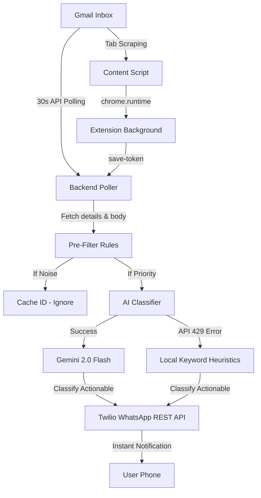

# 🚨 CareerPing AI — Intelligent Opportunity Detection & WhatsApp Alerts

CareerPing AI is a state-of-the-art pair of applications (a React-based Chrome Extension and a Node.js Express backend) designed to help job seekers capture every single job and internship opportunity instantly. 

By utilizing Google OAuth, the Gmail API, the Gemini 2.0 Flash AI, and Twilio WhatsApp notifications, CareerPing AI actively scans your inbox, filters out noise, classifies opportunities (interviews, assessments, offers, onboarding), extracts critical dates/deadlines, and sends urgent alerts directly to your WhatsApp!

---

## 🌟 Key Features

* **🛡️ Dual-Layer Real-time Detection:**
  * **Gmail Page DOM Scraper:** Active, low-footprint scraping of email rows directly in your browser.
  * **30-Second Background Poller:** Express-driven backend poller checking the Gmail API for new unread messages.
* **⚡ Advanced Pre-Filter Heuristic Rules:** Bypasses promotional spam, newsletter updates, and job board digests (Naukri, LinkedIn, Indeed) before triggering AI calls to protect API quota.
* **🧠 Smart Plain-Text Body Extraction:** A custom MIME-type parser parses multipart, plain-text, and HTML emails to extract the raw body so the system makes highly accurate decisions.
* **🤖 Gemini 2.0 Flash & Local Fallback:**
  * **AI Classification:** Standard classification with Gemini 2.0 Flash to extract urgency levels, next steps, deadlines, and key info.
  * **Robust Keyword Heuristic Fallback:** Automatically switches to a local regex keyword detector when the Gemini API hits a `429 Quota Exceeded` limit.
* **💬 Twilio WhatsApp Integration:** Sends elegant alerts instantly detailing the sender, subject, urgency, reason, and deadline.
* **🎨 Modern UI Extension Popup:** Dark-mode React application powered by Google OAuth, showing stats and classified items.

---

## 🏗️ Architectural Flow



---

## 📂 Project Structure

```text
AI-email-agent/
├── agent-backend/          # Node.js + Express backend service
│   ├── src/
│   │   ├── config/         # System configurations
│   │   ├── routes/         # Express API routes (/api/classify)
│   │   ├── services/       # Core engines: poller, filter, AI, WhatsApp
│   │   │   ├── ai-classifier.js   # Gemini AI & local fallback heuristics
│   │   │   ├── filter.js          # Pre-filter keywords and checks
│   │   │   ├── gmail-poller.js    # 30-sec polling manager & body parser
│   │   │   └── whatsapp.js        # Twilio API WhatsApp sender
│   │   └── utils/          # Logging utility
│   │   └── index.js        # Backend entry point
│   ├── .env                # Environment secrets (Twilio, Gemini, Port)
│   └── package.json
│
├── my-agent/               # Chrome Extension (Vite + React + TS)
│   ├── src/
│   │   ├── background/     # Background service worker (periodic scans)
│   │   ├── content/        # Content DOM scraping script
│   │   ├── services/       # Google API & backend handshake calls
│   │   └── App.tsx         # Modern popup dashboard UI
│   ├── manifest.json       # Chrome Extension permissions & scopes
│   └── package.json
```

---

## ⚙️ Setup and Configuration

### Prerequisites
* **Node.js** (v18 or higher)
* **Google Cloud Console account** (for Google OAuth client credentials)
* **Twilio Sandbox / Sandbox for WhatsApp** account
* **Google AI Studio account** (for a Gemini API Key)

---

### Step 1: Configure Backend Environment
Create a `.env` file inside `agent-backend/` containing:

```env
PORT=5000
GEMINI_API_KEY=your_gemini_api_key_here
TWILIO_ACCOUNT_SID=your_twilio_sid_here
TWILIO_AUTH_TOKEN=your_twilio_token_here
TWILIO_WHATSAPP_NUMBER=+14155238886
USER_PHONE_NUMBER=your_phone_number_with_country_code_here
```

---

### Step 2: Configure Chrome Extension
1. Go to the [Google Cloud Console](https://console.cloud.google.com/).
2. Create a project and set up OAuth Consent screen for your Gmail.
3. Under **Credentials**, create an **OAuth client ID** of type **Chrome Extension**.
4. In `my-agent/manifest.json`, specify your extension's Client ID and key:

```json
  "oauth2": {
    "client_id": "your_chrome_extension_oauth_client_id.apps.googleusercontent.com",
    "scopes": [
      "https://www.googleapis.com/auth/userinfo.email",
      "https://www.googleapis.com/auth/gmail.readonly"
    ]
  }
```

---

### Step 3: Run the Application

#### 1. Start the Backend Server:
```bash
cd agent-backend
npm install
npm run dev
```

#### 2. Build the Chrome Extension:
```bash
cd my-agent
npm install
npm run build
```

---

### Step 4: Load the Extension in Chrome
1. Open Google Chrome and go to URL: `chrome://extensions/`
2. Turn on **Developer mode** (top-right toggle switch).
3. Click **Load unpacked** (top-left button).
4. Select the **`my-agent/dist`** folder.
5. Click the CareerPing extension icon in your Chrome toolbar, click **Connect Gmail**, and authenticate!

---

## 🛠️ Troubleshooting

### 1. WhatsApp Notification is not arriving
* **Server was restarted?** Opening the Extension Popup once sends a token handshake (`/save-token`) to the backend. This handshake wakes up the background poller.
* **Sandbox Joined?** Make sure you have sent the required join code (e.g. `join <sandbox-name>`) to your Twilio WhatsApp sandbox number from your user phone.
* **Is email unread?** The poller only scans unread emails. Make sure the testing mail is marked as unread in your inbox.

### 2. TypeError: Failed to Fetch (in Extension console)
* This occurs when the background script loses connection because the backend server went offline. Make sure `node src/index.js` or `npm run dev` is running successfully in your backend terminal on port `5000`.

### 3. Gemini API 429 Quota Error
* If your free tier key runs out of daily requests, **do not worry!** The backend is equipped with local heuristics that will gracefully fallback, classify your email, and still trigger your WhatsApp notifications with 100% reliability.
